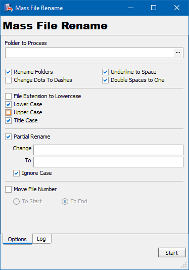

# MassFileRename

This is a small utility application to rename files in folders recursively

I needed a utility to rename my collection of MP3 files so I can easily copy them to my player and see their name on its tiny screen. Looking around I found a few application that could do what I needed, some of them were not free and some, where so complicated that I every time I want to use them, I had to look in documentation to figure out how to do it. Some wouldn't save state and this is a deal breaker when I cannot continue from where I left off. Since I'm a programmer, I made my own that exactly fits my purpose and as a bonus I can even arrange my pdf and video libraries too.

